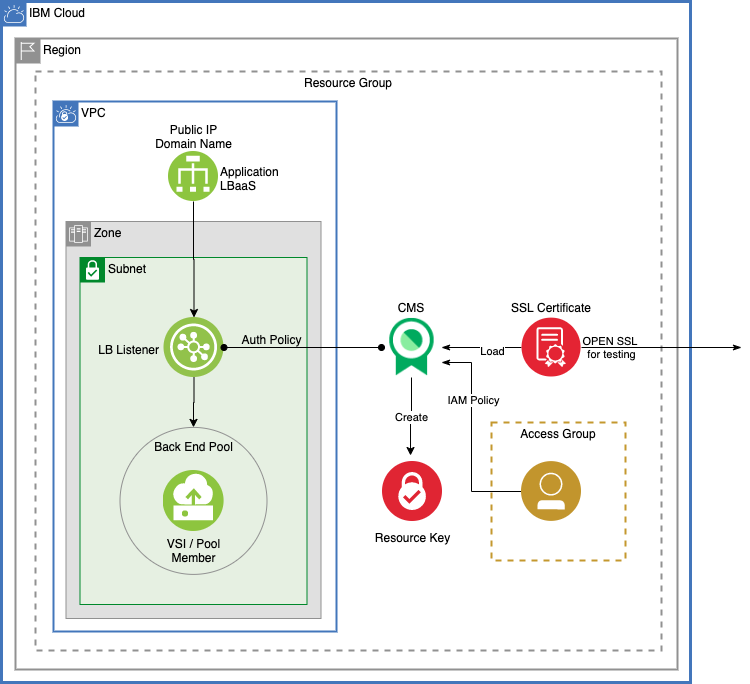

# Manage SSL certificates for IBM Cloud VPC Application Load Balancer

### Architecture Goals

1. Given an [IBM Cloud VPC Application Load Balancer as a Service (LBaaS)](https://cloud.ibm.com/docs/vpc?topic=vpc-load-balancers), create the minimum required services/configurations to provide a certificate for the Listener.
2. Demonstrate how the [IBM Cloud Certificate Management Service (CMS)](https://cloud.ibm.com/docs/certificate-manager) is required to order/hold the certificate. 
3. Show how to create an auth policy between LBaaS and CMS is also defined to enable the LBaaS LISTENER to read/write to the CMS.

---
### Description

This code pattern provides the necessary scripts to provision a basic VPC network with an Application Load Balancer as a service, and instance of IBM Certificate Manager Service (CMS) with access control policies for roles and for LBaaS to read from CMS. Then a certificate is ordered and loaded into the CMS service instance.

<kbd></kbd>

---
### Process

When you run this script it will

- create a certifcate manager instance
  - requests a certificate
  - loads certificate into cms
  
- create an instance of a VPC with
  - prefix address for a single zone
  - subnet in the zone
  - single VSI attached to subnet
  - LBaaS attached to subnet with a back end pool and listener
    - listener listens on https, port 443 and uses the certificate in the cms instance
    
- creates an access group 

- assigns access policy for
  - access group to access cms
  - LBaas to access cms to read certificate
